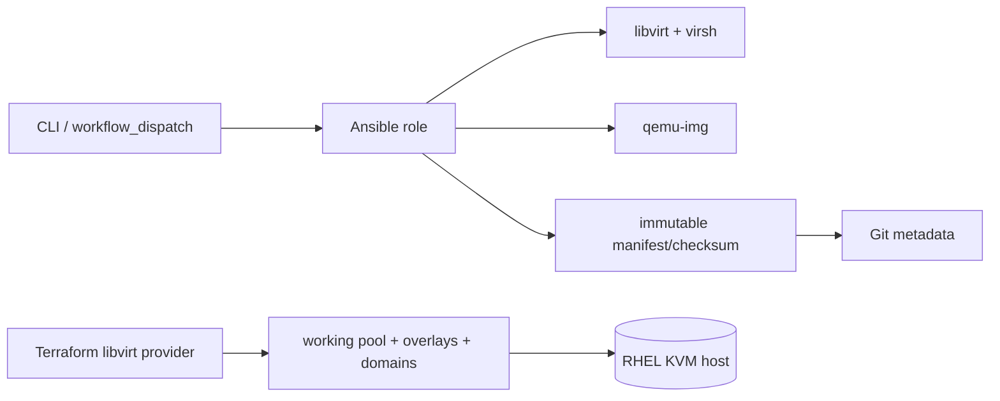

# KVM Lab Manager

Projektově orientovaný lifecycle manager pro již existující virtuální stroje RHEL 9 KVM/libvirt. Nástroj nic neprovisionuje: převezme názvy domén, zaregistruje jejich skutečnou konfiguraci, ukládá immutable checkpointy a vytváří dočasné pracovní runy.

## Model a bezpečnost

* **Projekt** je manifest identit existujících VM a jejich pořadí.
* **Checkpoint** je vždy samostatný, zploštěný QCOW2 (`qemu-img convert -O qcow2`), bez backing file, immutable a s checksumem.
* **Run** je disposable zapisovatelný QCOW2 overlay nad checkpointem. Base disk se nikdy nepřipojuje jako writable.
* Binární data zůstávají pod `kvm_lab_storage_root` na KVM hostu; Git obsahuje pouze YAML/JSON manifesty, kód a malé reporty.
* Hodnoty prostředí jsou pouze v konfiguraci/inventory. Wrapper validuje identifikátory a předává příkazy přes `command.argv`; destruktivní mazání používá přesné canonical cesty.



## Začínáme

1. Zkopírujte příklady mimo repozitář, doplňte pouze lokální proměnné a nastavte `KVM_LAB_CONFIG`, `KVM_LAB_INVENTORY`.
2. Nainstalujte Ansible kolekce z `requirements.yml`; na self-hosted RHEL runneru musí být dostupné `virsh`, `qemu-img`, `realpath`, Terraform a libvirt.
3. Zaregistrujte existující domény (operace je read-only):

```text
kvm-lab-manager register --project "${PROJECT_ID}" --config "${CONFIG_FILE}" --inventory "${INVENTORY_FILE}"
```

4. Výstupní manifest po kontrole uložte do Git. Vytvoření prvního checkpointu:

```text
kvm-lab-manager checkpoint --project "${PROJECT_ID}" --checkpoint "${CHECKPOINT_ID}" --config "${CONFIG_FILE}"
```

Aktivace čistého stavu, přepnutí a paralelní projekty:

```text
kvm-lab-manager activate --project "${PROJECT_ID}" --checkpoint "${CHECKPOINT_ID}" --run "${RUN_ID}" --mode replace --validation full
kvm-lab-manager park --project "${PROJECT_ID}" --run "${RUN_ID}"
kvm-lab-manager start --project "${PROJECT_ID}" --run "${RUN_ID}"
```

`replace` zaparkuje konfliktní registry podle exclusivity groups, `add` kolizi odmítne. Hostname/IP kolize musí být popsány v projektu; registry i locky brání souběžným operacím.

## Validace, checksumy a recovery

Quick ověřuje schema, identity, cesty, QCOW2 bez backing file, XML a volné místo. Full navíc spouští `qemu-img check`, znovu počítá SHA-256 a porovnává Git checksumy. Checksum detekuje poškození, nenahrazuje zálohu: immutable `checkpoints/` pravidelně zálohujte mimo host. Při chybě zůstane staging/quarantine adresář pro diagnostiku; opakujte idempotentní operaci po odstranění příčiny.

Terraform spravuje pouze pracovní pool, overlay volumes a domény; checkpointy nejsou resources. Backend se dodává zvenku (`-backend-config`), state key odvoďte z validovaných project/run proměnných a nikdy do něj nedávejte secrets. Provider je přesně připnut na ověřenou stabilní verzi `0.9.9`; upgrade nejprve proveďte v odděleném state, spusťte `terraform init -upgrade`, `validate` a prázdný plan.

## Testy a integrace

`tests/test_validation.py` testuje čisté validace/transforms bez libvirt. Integrační scénář pro skutečný RHEL KVM je v `tests/INTEGRATION.md`; neprovádí se automaticky. CI validuje Terraform/Ansible/YAML/JSON/schema/shell a na workflow_dispatch používá self-hosted runner label z repository variable `KVM_RUNNER_LABEL`.

```text
make validate
```

Přesné parametry, cesty, vlastníci, SELinux typy, timeouty, sítě, pooly, CPU, RAM, názvy i runner jsou záměrně jen placeholdery v `config/` a `inventories/`. Příklady nejsou automaticky načítány.